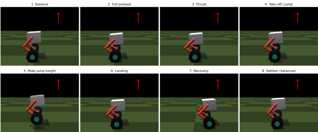
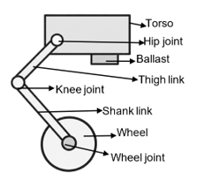
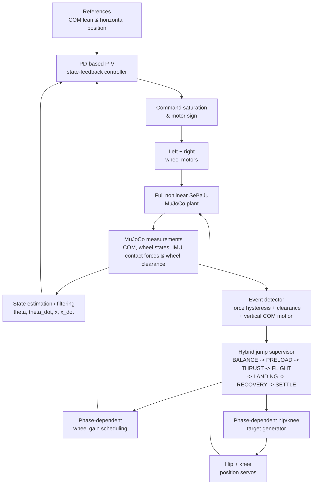
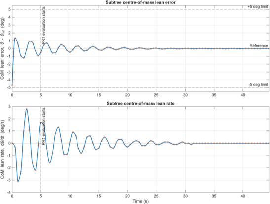
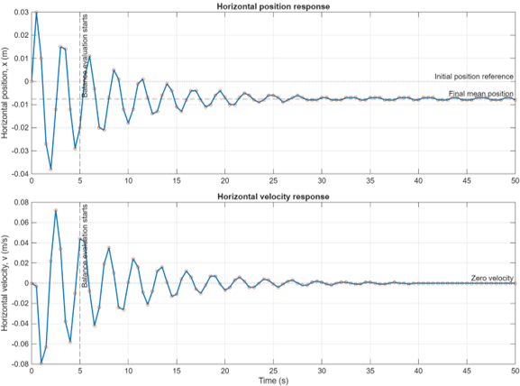
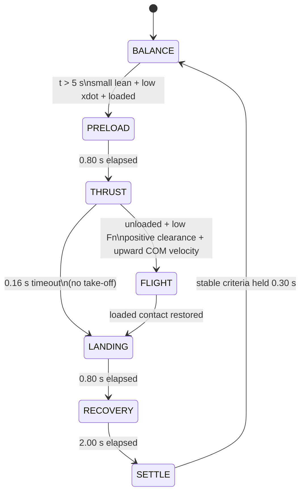
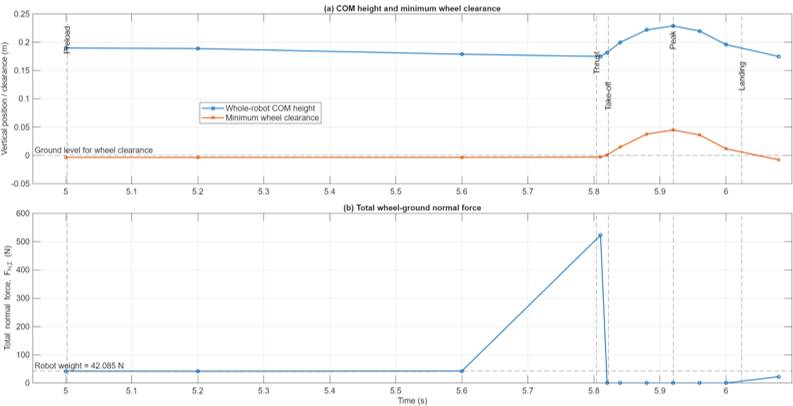
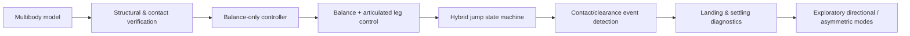
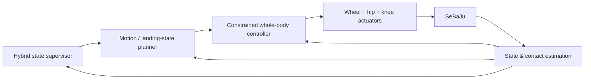

# SeBaJu - Self-Balancing Jumping Robot

**Design, dynamic modelling and hybrid control of a two-wheeled wheeled-biped robot in MuJoCo**

> MSc Professional Project - University of Leeds  
> Author: **Chukwuemerie Kennedy Chukwuma**  
> Module: **MECH5845M Professional Project**  
> Project type: **Simulation-based robotics and control proof of concept**

<p align="center">
  
</p>

## Overview

**SeBaJu** (Self-Balancing Jumping Robot) is a two-wheeled, articulated robot developed to investigate whether a comparatively transparent control architecture can achieve three difficult behaviours in one nonlinear simulation:

1. maintain wheel-supported balance without continuously rolling away;
2. coordinate articulated hip and knee motion to generate a genuine airborne jump; and
3. recover stable wheel-supported balance after landing.

The robot is modelled as a **12-DOF floating-base multibody system** in **MuJoCo**. The full simulation contains a free torso, two mirrored articulated legs, two driven wheels, bounded actuation, frictional ground contact, an IMU, whole-robot centre-of-mass measurements and wheel-state measurements.

The control architecture deliberately avoids full whole-body optimisation. Instead, SeBaJu combines:

- a **PD-based position-and-velocity (P-V) state-feedback balance controller** using whole-robot COM lean, lean rate, wheel displacement and wheel velocity;
- **position-controlled hip and knee joints** for posture generation;
- a **seven-state hybrid jump supervisor** for balance, preload, thrust, flight, landing, recovery and settling;
- **phase-dependent wheel-controller gains**;
- contact-force hysteresis, wheel-clearance checks and vertical COM motion for robust take-off/landing detection; and
- explicit actuator saturation and post-landing settling diagnostics.

The final evaluated simulation maintained nominal balance for **45 s**, achieved a **0.202 s airborne interval** with **0.045 m minimum wheel clearance**, and recovered balance after touchdown. The main limitation was post-impact recovery: the measured settling time was **4.632 s**, exceeding the project target of 3 s.

---

## Key Results

| Metric | Result |
|---|---:|
| Robot mass | **4.29 kg** |
| Physical DOF | **12** |
| Directly actuated joints | **6** |
| MuJoCo timestep | **0.002 s (500 Hz)** |
| Nominal balance test | **45 s without falling** |
| Balance samples within +/-5 deg criterion (5-45 s) | **81/81 = 100%** |
| Maximum wheel command during nominal balance | **0.106** (limit 0.35) |
| Take-off time | **5.822 s** |
| Landing time | **6.024 s** |
| Flight duration | **0.202 s** |
| Peak minimum wheel clearance | **0.045 m** |
| Peak relative wheel lift | **0.0484 m** |
| Measured take-off vertical COM velocity | **0.9486 m/s** |
| Ballistic estimate from airborne COM rise | **0.9386 m/s** |
| Difference between measured and ballistic estimate | **~1.0%** |
| Peak recorded thrust normal force | **522.83 N** |
| Average recorded thrust normal force | **265.41 N** |
| Post-landing settling time | **4.632 s** |
| Wheel-saturation steps during jump recovery | **14** |
| Leg saturation during evaluated jump | **None recorded** |

The result is therefore best interpreted as a **successful simulation proof of concept with a clearly identified landing/recovery limitation**, rather than as a hardware-ready controller.

---

## Mechanical Architecture

<p align="center">
  
</p>

SeBaJu is a floating-base two-wheeled biped. The torso is connected to the world through a MuJoCo `freejoint`, giving the base six physical degrees of freedom. Each side contains a hip hinge, knee hinge and continuously rotating wheel joint.

### Principal model parameters

| Parameter | Value |
|---|---:|
| Torso | 0.150 x 0.190 x 0.110 m |
| Torso mass | 2.50 kg |
| Ballast mass | 0.35 kg |
| Thigh length | ~0.130 m |
| Shank length | ~0.130 m |
| Wheel radius | 0.060 m |
| Wheel-centre spacing | 0.294 m |
| Total model mass | 4.29 kg |
| Hip range | -0.9 to +0.9 rad |
| Knee range | -0.9 to +0.9 rad |
| Wheel rotation | Continuous |

The forward-low ballast shifts the mass distribution so the nominal equivalent-body COM remains close to the wheel axle while lowering the overall COM.

### Actuation

The evaluated model uses two actuator classes:

- **Hip and knee joints:** MuJoCo position actuators for standing, preload, thrust, landing and recovery postures.
- **Wheel joints:** motor actuators used for rolling and balance correction.

The model currently contains:

```xml
<position name="left_hip_servo"  joint="left_hip"  kp="160" kv="12"
          ctrlrange="-0.6 0.6" forcerange="-60 60"/>
<position name="left_knee_servo" joint="left_knee" kp="200" kv="14"
          ctrlrange="-0.8 0.8" forcerange="-60 60"/>

<motor name="left_wheel_motor"  joint="left_wheel_joint"  gear="18" ctrlrange="-1 1"/>
<motor name="right_wheel_motor" joint="right_wheel_joint" gear="18" ctrlrange="-1 1"/>
```

An alternative Python motor-PD leg actuation mode is retained in the controller as an experimental implementation option, but the validated project result used the **position-servo configuration**.

---

## MuJoCo Simulation Model

The primary model is defined in `SeBaJu_BOT(II).xml`.

```xml
<compiler angle="radian" coordinate="local" inertiafromgeom="true"/>
<option timestep="0.002" gravity="0 0 -9.81" integrator="implicitfast"/>
```

Important modelling choices include:

- **local body coordinates** and radians;
- geometry-derived inertia;
- **0.002 s** simulation timestep;
- `implicitfast` integration;
- explicit wheel-ground friction;
- actuator command/force limits;
- a full 3-D floating torso even though the evaluated balance and jump motion is primarily sagittal; and
- measurable wheel contact forces and wheel clearance used as controller events rather than relying on visual inspection alone.

### Contact/friction values

| Geometry | Sliding | Torsional | Rolling |
|---|---:|---:|---:|
| Default robot geometry | 1.8 | 0.030 | 0.003 |
| Ground | 1.2 | 0.050 | 0.005 |
| Wheels | 2.2 | 0.040 | 0.004 |

---

## Sensing and State Estimation

The MuJoCo model exposes torso and wheel measurements through named sensors, including:

- torso quaternion (`imu_quat`);
- torso angular velocity (`imu_gyro`);
- torso acceleration (`imu_accel`);
- IMU position (`imu_pos`);
- whole-robot COM position (`robot_com`);
- left/right wheel positions; and
- left/right wheel angular velocities.

For balance control, the whole-robot COM is measured relative to the midpoint of the wheel centres. The controller forms a sagittal COM lean angle from this geometry and estimates horizontal displacement from the mean wheel rotation.

The wheel-based displacement estimate is equivalent to

$$
x = \frac{r}{2}\left[(\phi_L-\phi_{L,0})+(\phi_R-\phi_{R,0})\right]
$$

and wheel velocity is estimated from

$$
\dot{x}_{raw}=\frac{r}{2}(\omega_L+\omega_R).
$$

A first-order low-pass filter is applied before velocity feedback:

$$
\dot{x}_k = \alpha_v\dot{x}_{k-1} + (1-\alpha_v)\dot{x}_{raw,k},
\qquad \alpha_v=0.70.
$$

The current controller also estimates vertical COM velocity by finite-differencing the measured COM height at the MuJoCo timestep. The raw value is retained for take-off detection so that filtering does not hide a short transient event.

---

# Control Architecture

## Overall closed-loop structure



The reduced wheeled-inverted-pendulum model is used to **interpret the balance mechanics**, but the controller is executed against the complete nonlinear MuJoCo model.

---

## 1. PD-Based Position-and-Velocity State Feedback

The balance state combines rotational and translational motion:

$$
\mathbf{x}_b=
\begin{bmatrix}
e_{\theta_{COM}} & \dot{\theta}_{COM} & e_x & \dot{x}
\end{bmatrix}^{T}.
$$

The implemented wheel-control law is

$$
u_{raw}=
K_{\theta}e_{\theta_{COM}}
+K_{\dot{\theta}}\dot{\theta}_{COM}
-K_{\dot{x}}\dot{x}
-K_xe_x.
$$

For the nominal balance state, the tuned gains used in the final project evaluation were:

| Gain | Value | Purpose |
|---|---:|---|
| `K_THETA` | 1.30 | Correct COM lean |
| `K_THETA_D` | 0.17 | Dampen lean-rate motion |
| `K_X_D` | 0.16 | Dampen horizontal velocity |
| `K_X` | 0.80 | Regulate horizontal displacement |
| `MAX_WHEEL` | 0.35 | Limit balance command |

The current implementation is intentionally direct and readable:

```python
wheel_u_unsat = (
    Kth   * (theta - theta_ref_local)
    + Kthd * theta_dot
    - Kxd  * xdot
    - Kx   * (x - x_ref)
    - K_X_I * x_i
    + wheel_ff
)

wheel_u_target = WHEEL_MOTOR_SIGN * clamp(
    wheel_u_unsat,
    -max_wheel_state,
    +max_wheel_state
)

data.ctrl[act_lwheel] = wheel_u
data.ctrl[act_rwheel] = wheel_u
```

The same wheel command is applied to both wheels for sagittal balance, avoiding an unintended yaw command.

### Why position feedback matters

A lean-only controller can keep a wheeled inverted pendulum approximately upright while allowing the robot to continue translating. Adding `x` and `xdot` feedback means wheel motion is used mainly to reposition the support point beneath the COM and is then driven back towards a stationary operating condition.

---

## Nominal Balance Result

<p align="center">
  
</p>

During the 45 s nominal test:

- SeBaJu remained balanced without falling;
- after the initial 5 s transient, **81/81 recorded COM-lean samples (100%)** satisfied the +/-5 deg project criterion;
- from 5 s onward, the recorded lean error remained within approximately +/-1 deg;
- the maximum logged wheel command was **0.106**, below the configured `0.35` limit; and
- no wheel or leg saturation was recorded in the nominal balance test.

<p align="center">
  
</p>

The initial balancing transient caused the wheels to move forward and backward as the controller shifted the support point. The maximum recorded absolute position and velocity were approximately **0.036 m** and **0.077 m/s**. By the end of the test, horizontal velocity was effectively zero and the position remained bounded near the starting location.

---

# Hybrid Jump Controller

Balancing is only one operating condition. Jumping changes the leg configuration, ground reaction forces and contact state, so one fixed control mode is not sufficient.

SeBaJu therefore uses a seven-state hybrid supervisor:



### Engineering purpose of each phase

| State | Purpose |
|---|---|
| **BALANCE** | Establish a stable wheel-supported initial condition |
| **PRELOAD** | Crouch the legs and increase extension stroke |
| **THRUST** | Extend rapidly to generate vertical ground impulse |
| **FLIGHT** | Hold the measured take-off leg posture while wheel contact is absent |
| **LANDING** | Move towards a flexed impact-absorption posture |
| **RECOVERY** | Gradually return the legs towards the nominal stance |
| **SETTLE** | Verify that the complete robot has returned to a stable region |

---

## 2. Phase-Dependent Leg Targets

The validated base jump uses symmetric left/right joint offsets relative to the standing posture:

| Phase | Hip offset | Knee offset |
|---|---:|---:|
| Standing | 0 rad | 0 rad |
| Preload | +0.12 rad | -0.22 rad |
| Thrust | -0.27 rad | +0.44 rad |
| Landing | +0.08 rad | -0.20 rad |

Preload, landing and recovery use a cubic smooth-step profile:

$$
\sigma(s)=3s^2-2s^3,
\qquad
q_d(t)=q_a+\sigma(s)(q_b-q_a).
$$

The implementation is:

```python
def smoothstep01(t, T):
    if T <= 0.0:
        return 1.0
    tau = clamp(t / T, 0.0, 1.0)
    return 3.0 * tau**2 - 2.0 * tau**3
```

The short thrust phase uses a faster ease-out profile so more extension occurs early in the interval:

```python
def fast_thrust01(t, T):
    if T <= 0.0:
        return 1.0
    tau = clamp(t / T, 0.0, 1.0)
    return 1.0 - (1.0 - tau)**3
```

At detected take-off, the controller freezes the **measured** hip and knee angles rather than assuming the commanded thrust target has been perfectly reached. Landing interpolation similarly begins from the measured touchdown posture.

---

## 3. Phase-Dependent Wheel Balancing

The balance controller remains active across the jump, but its gains and command limit are scheduled according to the active phase.

| State | Ktheta | Ktheta_dot | Kx_dot | Kx | max wheel |
|---|---:|---:|---:|---:|---:|
| BALANCE | 1.30 | 0.17 | 0.16 | 0.80 | 0.35 |
| PRELOAD | 1.30 | 0.22 | 0.20 | 0.40 | 0.35 |
| THRUST | 1.30 | 0.25 | 0.18 | 0.08 | 0.35 |
| FLIGHT | 1.30 | 0.10 | 0.00 | 0.00 | 0.10 |
| LANDING | 1.30 | 0.18 | 0.10 | 0.00 | 0.22 |
| RECOVERY | 1.30 | 0.20 | 0.12 | 0.16 | 0.28 |
| SETTLE | 1.30 | 0.17 | 0.22 | 0.12 | 0.35 |

This schedule weakens horizontal position regulation during preload and thrust, removes it during flight/landing, and progressively restores it after touchdown. The intention is to stop the wheel controller from strongly opposing the leg-generated manoeuvre.

After landing, the horizontal reference is normally reset to the measured landing location. The first recovery objective is therefore **regain balance where the robot lands**, rather than immediately forcing it back to the original starting point.

---

## 4. Contact Hysteresis and Event Detection

A visual gap between the wheel and floor is not sufficient evidence of take-off in a compliant contact simulation. SeBaJu combines force, geometry and motion measurements.

The controller calculates separate load/unload thresholds from robot weight:

```python
robot_mass = float(np.sum(model.body_mass))
robot_weight = robot_mass * G

F_CONTACT_OFF = max(F_CONTACT_OFF_MIN,
                    F_CONTACT_OFF_RATIO * robot_weight)
F_CONTACT_ON = max(F_CONTACT_ON_MIN,
                   F_CONTACT_ON_RATIO * robot_weight)
```

For the 4.29 kg model, the project thresholds are approximately:

- **contact-off:** 1.50 N;
- **contact-on:** 6.31 N.

Using different thresholds creates hysteresis and prevents repeated state switching around one noisy boundary. The controller also requires the force condition to persist for several simulation steps.

### Take-off condition

Take-off is accepted only when the independent signals agree:

```python
takeoff_detected = (
    airborne
    and Fn_total < F_CONTACT_OFF
    and wheel_clear_air
    and com_z_vel_raw > TAKEOFF_VZ_MIN
)
```

where `wheel_clear_air` requires both:

```python
wheel_clear_air = (
    min_wheel_gap > WHEEL_CLEARANCE_TAKEOFF_ABS
    and gap_rel > WHEEL_CLEARANCE_TAKEOFF_REL
)
```

with thresholds of **0.5 mm absolute clearance** and **3 mm lift relative to the loaded wheel reference**.

This is a deliberate distinction between **body extension** and a **genuine jump**: the legs can raise the torso while the wheels are still carrying load, so COM height alone is not used as proof of flight.

---

# Vertical Jump Result

<p align="center">
  
</p>

The evaluated sequence progressed through balance, full preload, thrust, take-off, peak flight, landing, recovery and settled balance.

### Recorded event sequence

| Event | Time |
|---|---:|
| Preload begins | 5.002 s |
| Thrust begins | 5.804 s |
| Take-off detected | 5.822 s |
| Landing detected | 6.024 s |
| Flight duration | 0.202 s |

During preload, whole-robot COM height fell from **0.1898 m** to **0.1747 m**, confirming a 0.0151 m crouch before thrust.

During thrust, the recorded total wheel normal force rose sharply, with a measured peak of **522.83 N** and an average of **265.41 N** over the recorded thrust interval. This force substantially exceeded the robot weight (~42.08 N), producing the upward impulse required for take-off.

At take-off:

- total wheel normal force had dropped to zero;
- minimum absolute wheel clearance was approximately 0.0015 m;
- relative wheel lift was approximately 0.0049 m; and
- raw vertical COM velocity was **0.9486 m/s**.

<p align="center">
  
</p>

The peak minimum wheel clearance reached **0.045 m**, and the COM rose **0.0449 m** after detected take-off. An independent ballistic consistency check gives

$$
v_{z,to,est}=\sqrt{2g\Delta h}=0.9386\;m/s,
$$

which differs from the directly logged take-off velocity of 0.9486 m/s by approximately **1%**.

This close agreement is useful because it checks the simulated airborne response using a physical relationship independent of the contact detector.

---

## Landing and Recovery

Touchdown was more demanding than nominal balance. During the post-landing interval, the final project evaluation recorded:

- maximum horizontal velocity: **1.593 m/s**;
- maximum absolute COM lean rate: **145.8 deg/s**;
- full settling time: **4.632 s**;
- wheel saturation: **14 simulation steps**; and
- no recorded leg saturation.

Recovery was declared only when the robot remained inside a multi-variable stable region for at least 0.30 s:

- COM lean error < 2 deg;
- COM lean rate < 8 deg/s;
- horizontal velocity < 0.04 m/s;
- wheel command < 0.06; and
- horizontal error relative to landing position < 0.015 m.

The robot eventually returned to stable wheel-supported balance, but the **4.632 s** settling time exceeded the project requirement of **3 s**. This is the principal performance limitation identified by the project.

---

## Performance Requirement Assessment

| Requirement | Target | Recorded outcome | Assessment |
|---|---|---|---|
| Sustained balance | >=10 s without falling; >=95% within +/-5 deg after settling | 45 s; 100% (81/81) from 5-45 s | **Met** |
| Clear jump | Both wheels >=0.005 m above ground for >=0.020 s | 0.045 m peak minimum clearance; 0.202 s flight | **Met** |
| Complete landing | Restore wheel contact without robot-ground collision | Contact restored and balance recovered; non-wheel ground contact was not independently logged | **Met visually** |
| Recovery | Stable region within 3 s | 4.632 s | **Not met** |
| Actuator limits | Enforce limits and report saturation | 14 wheel-saturation steps; no leg saturation | **Met, limited wheel margin** |
| Event detection | Detect take-off/landing from measured signals | Force hysteresis + clearance + vertical COM motion | **Met** |

I retain the failed recovery requirement in this README intentionally. It is an important engineering result: the project demonstrates not only what the controller achieved, but also **where the current architecture becomes insufficient**.

---

# Current Repository Files

The repository contains several development generations because the project evolved from basic balancing to jumping and then to exploratory locomotion modes.

### Files most relevant to the final project

| File | Role |
|---|---|
| `SeBaJu_BOT(II).xml` | Primary MuJoCo model used by the current controller |
| `SeBaJu_Ctrl_BalJumpAchieve.py` | Focused balance + vertical-jump controller corresponding closely to the validated report result |
| `SeBaJu_BOT(II)_mainCtrl.py` | Extended controller containing the validated base jump plus additional experimental modes |
| `SeBaJu_BOT(II)_Ctrl_Balancing.py` | Balance-only controller used during staged controller development |
| `cascade_pid.py` | Earlier/alternative controller-development experiment |

The repository also retains older model/controller variants as a record of the iterative development process. For a portfolio-facing version, these can eventually be moved into an `archive/` or `experiments/` directory so the validated implementation is immediately obvious to a reviewer.

---

## Experimental Modes in the Extended Controller

`SeBaJu_BOT(II)_mainCtrl.py` currently contains selectors for:

```python
EXPERIMENT_MODE = "BASE_JUMP"

# Other implemented development modes:
# "INDIVIDUAL_LEG_TEST"
# "SLANT_LEFT"
# "SLANT_RIGHT"
# "ROLL_FORWARD"
# "ROLL_BACKWARD"
# "STEP_LEFT"
# "STEP_RIGHT"
# "JUMP_FORWARD"
# "JUMP_BACKWARD"
```

Only the **nominal balance and vertical/base jump** are quantitatively validated in the submitted project report. Directional jumping, differential-leg/slant behaviour and stepping remain **exploratory development modes** and should not be interpreted as validated capabilities.

---

# Running the Simulation

## Requirements

- Python 3
- MuJoCo Python package
- NumPy

Install the Python dependencies:

```bash
pip install mujoco numpy
```

Clone the repository:

```bash
git clone https://github.com/k3nkreate/SeBaJu_BOT_5845.git
cd SeBaJu_BOT_5845
```

Run the validated balance/jump implementation:

```bash
python SeBaJu_Ctrl_BalJumpAchieve.py
```

or run the extended controller:

```bash
python "SeBaJu_BOT(II)_mainCtrl.py"
```

The controller expects `SeBaJu_BOT(II).xml` to be available beside the Python script unless `XML_FILE` is changed.

The MuJoCo passive viewer opens automatically and displays the simulation while the controller logs state, contact, actuator and jump diagnostics to the terminal.

---

# Controller Development Strategy

The project was intentionally developed in stages:



This staged approach made individual failures easier to diagnose than beginning immediately with a high-complexity optimisation controller.

---

# What This Project Demonstrates

From an engineering perspective, the repository demonstrates experience with:

- multibody robot modelling in **MuJoCo/MJCF**;
- floating-base systems and articulated kinematic chains;
- wheeled inverted-pendulum balance mechanics;
- reduced-order dynamic modelling using Euler-Lagrange methods;
- manually tuned multi-state feedback control;
- centre-of-mass based state estimation;
- low-pass filtering of measured/derived states;
- hybrid state machines;
- gain scheduling;
- contact-force processing;
- Schmitt-trigger/hysteresis event logic;
- trajectory interpolation and posture transitions;
- actuator saturation monitoring;
- ballistic consistency checks;
- simulation diagnostics and performance requirements; and
- critical evaluation of controller limitations rather than reporting success alone.

---

# Limitations

This repository should be interpreted within the scope of the project:

1. **Simulation only.** No physical SeBaJu prototype was built or experimentally validated.
2. **Main evaluation is sagittal.** The MuJoCo base is 3-D, but the primary hip/knee axes and validated control tests are sagittal.
3. **Nominal balance test.** The 45 s balance evaluation did not include a prescribed external disturbance test.
4. **Landing recovery remains slow.** The 4.632 s recovery time failed the 3 s target.
5. **Wheel actuation approaches saturation after impact.** Fourteen saturation steps were recorded during jump recovery.
6. **Collision instrumentation is incomplete.** Landing was visually checked for non-wheel ground collision; torso/thigh/shank collision was not separately logged in the final evaluation.
7. **Sim-to-real effects remain simplified.** Backlash, motor current/thermal behaviour, sensor noise, latency, tyre deformation, structural compliance and uncertain friction would need additional modelling or physical identification.
8. **Directional and asymmetric modes are exploratory.** They are present in the extended controller but were not quantitatively validated to the same standard as balance and the vertical jump.

---

# Future Work

The most immediate improvement is **landing and recovery control**, not simply increasing jump height.

Useful next steps include:

- state-dependent landing gains based on touchdown COM velocity, lean rate and horizontal velocity;
- compliant/virtual spring-damper hip and knee behaviour for impact absorption;
- a planned landing state rather than a single fixed landing posture;
- constrained whole-body control if gain scheduling becomes insufficient;
- quantitative validation of forward/backward jumping;
- obstacle-clearance and landing-location metrics;
- asymmetric leg control and unequal-support-height tests;
- 3-D disturbance robustness;
- sensor noise, delay, friction and model-parameter uncertainty studies;
- explicit non-wheel collision logging; and
- eventual hardware design, system identification and experimental validation.

A longer-term architecture could retain the current hybrid supervisor while replacing fixed postures with a planning/control hierarchy:



---

# Project Outcome

The project achieved its central simulation objective: SeBaJu can maintain wheel-supported balance, coordinate articulated leg motion to leave the ground, detect take-off and landing from measurable signals, and recover balance after touchdown.

The work also produced a useful negative result. **Take-off was not the hardest part of the manoeuvre; landing recovery was.** The controller generated a physically consistent airborne response, but the 4.632 s settling time and wheel saturation show why richer coordination of wheel, body and leg dynamics becomes increasingly valuable after impact.

That result defines the next engineering problem rather than hiding it.

---

## Author

**Chukwuemerie Kennedy Chukwuma**  
MSc Engineering - University of Leeds  
2026

Repository: `k3nkreate/SeBaJu_BOT_5845`

---

## Academic Context

This repository accompanies the MSc professional project:

**"Design, Dynamic Modelling and Control of Self-Balancing Robot with Jump Actuation"**

The repository is shared as an engineering portfolio and reproducibility resource. The project results are simulation-based and should not be interpreted as verified physical-hardware performance.
